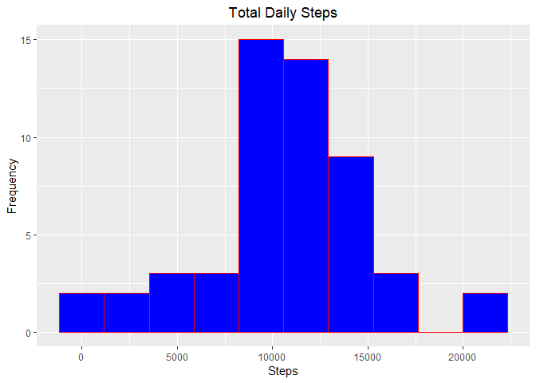
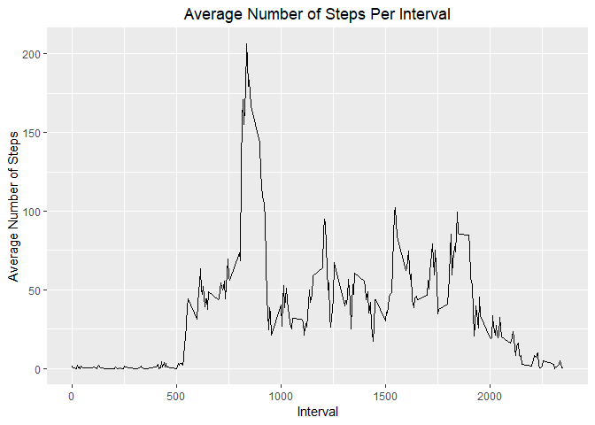
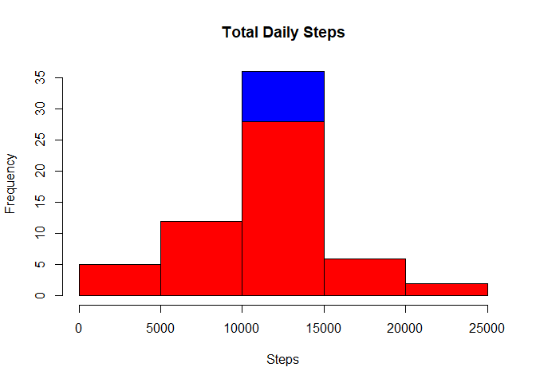
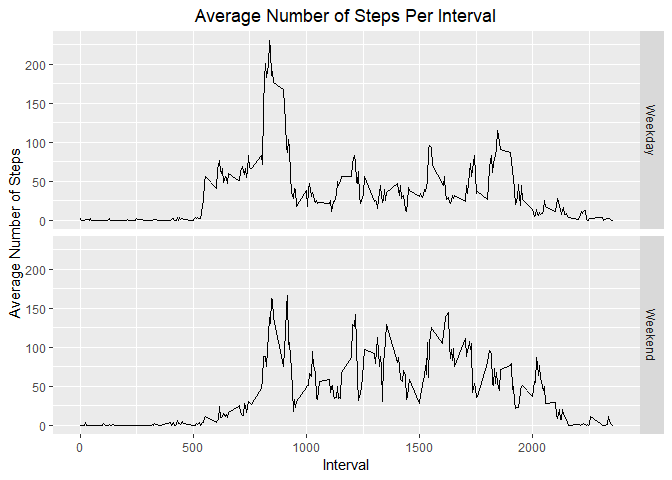

#The Project

The assignment makes use of data from a personal activity monitoring device. This device collects data at 5 minute intervals throughout the day. The data consists of two months of data from an anonymous individual collected during the months of October and November, 2012 and include the number of steps taken in 5 minute intervals each day.

The data for the project was downloaded from the course website:

* Dataset:[Activity monitoring data](https://d396qusza40orc.cloudfront.net/repdata%2Fdata%2Factivity.zip)[52k]

The variables included in the data set are:

* **steps:** Number of steps taken in a 5-minute interval (missing values are coded as **NA**)
* **date:** The date on which the measurement was taken in YYYY-MM-DD format
* **interval:** Identifier for the 5-minute interval in which the measurement was taken

The data is stored in a comma-seperated-value (CSV) file and there are a total of 17,568 observations in the dataset.

#Loading and Processing the Data

Load the data from the working directory.


```r
library(ggplot2)
```

```
## Warning: package 'ggplot2' was built under R version 3.5.2
```

```r
data<-read.csv("activity.csv")
```

The next step is to process the data. Specifically, correct the type of the date column. We will also add a column describing whether the date of the observation occurred on a weekday or weekend. Finally, we will subset the data excluding the missing step values.


```r
data$date<-as.Date(data$date)
data$day<-weekdays(data$date)
completeData<-subset(data, !is.na(data$steps))
```

#What is the mean total number of steps taken per day?

Display the total number of steps taken per day using a histogram.


```r
stepTotal<-aggregate(completeData$steps ~ completeData$date, FUN = sum)
colnames(stepTotal)<-c("Date", "Steps")
qplot(stepTotal$Steps, geom = "histogram", fill = I("blue"), color = I("red"), bins = 10, main = "Total Daily Steps", xlab = "Steps", ylab = "Frequency") + theme(plot.title = element_text(hjust = 0.5))
```

<!-- -->

Calculate the mean and the median of the total number of steps taken per day.


```r
meanSteps<-format(round(as.numeric(mean(stepTotal$Steps)), 0), big.mark = ",")
medianSteps<-format(round(as.numeric(median(stepTotal$Steps)), 0), big.mark = ",")
```

The mean of the total number of steps taken per day is 10,766 and the median is 10,765.

#What is the average daily activity pattern?

Display in a time series plot the average number of steps during 5-minute intervals (x-axis), averaged across all days (y-axis).


```r
intervalMean<-aggregate(completeData$steps ~ completeData$interval, FUN = mean)
colnames(intervalMean)<-c("Interval", "Steps")
ggplot()+geom_line(data = intervalMean, mapping = aes(x = Interval, y = Steps)) + xlab("Interval") + ylab("Average Number of Steps") + ggtitle("Average Number of Steps Per Interval") + theme(plot.title = element_text(hjust = 0.5))
```

<!-- -->

Which 5-minute interval, on average across all the days in the dataset, contain the maximum number of steps?


```r
maxSteps<-max(intervalMean$Steps)
maxStepsForm<-format(round(as.numeric(maxSteps), 2), big.mark = ",")
```

The 5-minute interval containing the maximum number of steps on average across all of the days in the dataset is 835, which averaged 206.17.

#Impute missing values.

There are a number of days/intervals where there are missing values (coded as **NA**). The presence of missing days may introduce bias into some calculations or summaries of the data.

Calculate and report the total number of missing values in the dataset.


```r
dataNA<-format(nrow(data[is.na(data$steps), ]), big.mark = ",")
```

The total number of missing values in the dataset is 2,304.

Impute values of the missing data by using the mean of the 5-minute interval.


```r
imputeData<-transform(data, steps = ifelse(is.na(data$steps), intervalMean$Steps[match(data$interval, intervalMean$Interval)], data$steps))
```

Present a histogram of the total number of steps taken each day.


```r
imputeStepTotal<-aggregate(imputeData$steps ~ imputeData$date, FUN = sum)
colnames(imputeStepTotal)<-c("Date", "Steps")
hist(imputeStepTotal$Steps, breaks = 5, xlab = "Steps", main = "Total Daily Steps", col = "blue")
hist(stepTotal$Steps, breaks = 5, xlab = "Steps", main = "Total Daily Steps", col = "red", add = TRUE)
```

<!-- -->

Calculate and report the mean and median total number of steps taken per day.


```r
imputeMeanSteps<-format(round(as.numeric(mean(imputeStepTotal$Steps)), 0), big.mark = ",")
imputeMedianSteps<-format(round(as.numeric(median(imputeStepTotal$Steps)), 0), big.mark = ",")
meanDiff<-mean(imputeStepTotal$Steps) - mean(stepTotal$Steps)
medianDiff<-round(median(imputeStepTotal$Steps) - median(stepTotal$Steps), 4)
totalDiff<-format(round(sum(imputeData$steps) - sum(completeData$steps), 0), big.mark = ",")
```

The imputed data mean is 10,766 which is a difference of 0 from the original data. The median of the imputed data is 10,766 which is a difference of 1.1887. The total number of steps increased by 86,130 in the imputed data.

#Are there differences in activity patterns between weekdays and weekends?

Create a new factor variable in the dataset with the level weekday or weekend, indicating whether a given date occurred during the week or weekend.


```r
imputeData$day<-ifelse(imputeData$day %in% c("Saturday", "Sunday"), "Weekend", "Weekday")
```

Make a panel plot containing a time series plot of the 5-minute interval (x-axis) and the average number of steps taken, averaged across all weekdays or weekend days (y-axis).


```r
intervalMeanDay<-aggregate(imputeData$steps ~ imputeData$interval + imputeData$day, FUN = mean)
colnames(intervalMeanDay)<-c("Interval", "Day", "Steps")
ggplot()+geom_line(data = intervalMeanDay, mapping = aes(x = Interval, y = Steps)) + xlab("Interval") + ylab("Average Number of Steps") + ggtitle("Average Number of Steps Per Interval") + facet_grid(Day ~ .) + theme(plot.title = element_text(hjust = 0.5))
```

<!-- -->
